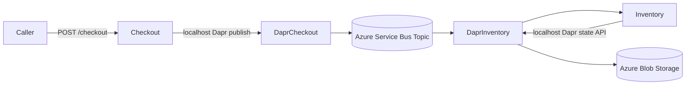

# ACA + Dapr Enterprise Service Bus Repo

This repository is an Azure-only deployment kit for short-term production stabilization of Dapr workloads on Azure Container Apps (ACA), using an Enterprise Service Bus pattern.

## Architecture model

- Messaging broker: Azure Service Bus topic via Dapr pub/sub component
- State store: Azure Blob Storage via Dapr state store component
- Runtime: ACA with Dapr sidecars enabled for both services
- Registry auth: Managed identity + AcrPull role assignments to ACR

No local broker or local runtime path is part of this repository.

## What this gives you

- A two-service production flow:
  - `checkout-service` publishes `orders` events
  - `inventory-service` subscribes to `orders` and persists reservation state
- Infrastructure as code for ACA, Service Bus, Blob Storage, and Dapr components
- Operational runbooks for incident-time rollout and validation

## Repo layout

- `apps/checkout-service` : API that publishes order events to Dapr pub/sub
- `apps/inventory-service` : event consumer and state writer through Dapr state API
- `docs` : deployment and operations guidance
- `infra` : Azure Bicep and parameterization
- `scripts` : deployment automation

## Deploy to Azure

1. Set required values in `infra/main.parameters.json`:
   - `acrName`
   - `storageAccountName`
   - `serviceBusNamespaceName`
   - `checkoutImage`
   - `inventoryImage`
2. Run deployment:

```bash
./scripts/deploy-azure.sh -g rg-aca-dapr -l westeurope
```

3. Follow validation and triage steps in `docs/deploy-aca.md`.

## How it works

1. `checkout-service` receives an order request and publishes to Dapr topic `orders`.
2. Dapr routes message to Azure Service Bus-backed `pubsub` component.
3. `inventory-service` receives the event via Dapr subscription endpoint.
4. `inventory-service` writes reservation state via Dapr `statestore` component.
5. Dapr persists state to Azure Blob Storage container `dapr-state`.



## What to expect in production

- At-least-once delivery semantics from pub/sub: duplicates are possible and handlers must remain idempotent.
- Short transient processing delays during rollouts or scale operations.
- Better durability and decoupling compared with local in-memory or local broker patterns.
- Sidecar/component startup ordering can still affect warm-up; probes and min replicas reduce this risk.
- Broker messages are not deleted by app code; they are completed/expired according to Service Bus semantics and TTL policy.
- State data retention is bounded by Blob lifecycle policy (`stateBlobRetentionDays`).

Use `docs/challenge-playbook.md` during incidents and `docs/deploy-aca.md` for deploy/verify steps.
