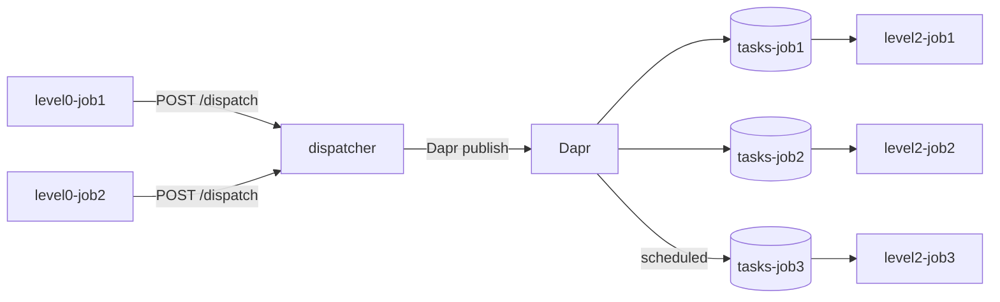

# ACA + Dapr Jobs Pipeline

This repository is an Azure-only deployment kit for an event-driven, three-tier processing pipeline on Azure Container Apps (ACA). It replaces "lots of CRON jobs" with a Dapr pub/sub fan-out that scales workers on demand.

## Architecture model

- **Level 0 — two producer jobs** (`level0-job1` = orders feed, `level0-job2` = signups feed): manual-trigger ACA Jobs that read an input file line by line and HTTP POST each line as a structured task to the dispatcher.
- **Level 1 — dispatcher** (`dispatcher`): an always-on ACA app with a Dapr sidecar. It uses **Dapr pub/sub** to decide *how* (which of three topics/worker jobs handles each task, via routing rules) and *when* (run immediately, or hold it using `ScheduledEnqueueTimeUtc`).
- **Level 2 — three worker jobs** (`level2-job1` priority orders, `level2-job2` standard orders, `level2-job3` welcome/signups): event-driven ACA Jobs, each KEDA-scaled on its own Service Bus topic/subscription. One execution per message; no CRON.

ACA Jobs cannot run Dapr sidecars, so the Dapr pub/sub publish lives only in the always-on Level 1 app. Level 0 uses plain HTTP, Level 2 uses the Service Bus SDK.

## What this gives you

- A two-feed → route → three-worker pipeline that fans out work without scheduled polling.
- Dapr-driven routing ("how") and scheduled delivery ("when") decided in one place.
- KEDA `azure-servicebus` scaling so each worker runs exactly when there are messages.
- Infrastructure as code for the ACA environment, Service Bus, Dapr pub/sub component, and RBAC.

## Repo layout

- `apps/level0-job` : producer image; runs as `level0-job1` (orders) and `level0-job2` (signups) via env
- `apps/level1-dispatcher` : always-on Dapr app (`dispatcher`) that routes each task to a topic
- `apps/level2-job` : worker image; runs as `level2-job1/2/3`, each KEDA-scaled on its own topic
- `docs` : deployment and pipeline guidance
- `infra` : Azure Bicep and parameterization
- `scripts` : deployment automation

## Deploy to Azure

1. Set required values in `infra/main.parameters.json`:
   - `acrName`
   - `serviceBusNamespaceName`
   - `dispatcherImage`
   - `level0Image`
   - `level2Image`
2. Run deployment:

```bash
./scripts/deploy-azure.sh -g rg-aca-dapr -l westeurope
```

3. Start the pipeline by triggering the Level 0 producer jobs:

```bash
az containerapp job start -g rg-aca-dapr -n level0-job1   # orders
az containerapp job start -g rg-aca-dapr -n level0-job2   # signups
```

## How it works

1. `level0-job1` and `level0-job2` read their input files and POST one structured task per line (`{ taskId, kind, payload, ... }`) to the dispatcher's `/dispatch` endpoint.
2. `dispatcher` runs its routing rules to pick a target topic and an optional delay, then publishes via the Dapr `pubsub` component:
   - `order` amount ≥ `highValueThreshold` → `tasks-job1` (priority), immediate.
   - `order` amount < threshold → `tasks-job2` (standard), immediate.
   - `signup` → `tasks-job3` (welcome), delayed by `signupDelaySeconds` via `ScheduledEnqueueTimeUtc`.
3. New messages on each topic's `workers` subscription trigger KEDA to start the matching `level2-job{1,2,3}` execution.
4. Each worker execution receives a message, runs `processTask`, and completes it.



## What to expect in production

- At-least-once delivery: duplicates are possible, so `processTask` must remain idempotent.
- Workers scale from zero on demand; expect brief cold-start delays when a topic goes from empty to busy.
- Scheduled (delayed) messages stay invisible to KEDA until their enqueue time, so the welcome worker only wakes after the delay.
- Messages are completed by the worker or expire per the topic TTL (`serviceBusDefaultMessageTimeToLive`).
- No scheduled polling: work runs only when the Level 0 feeds dispatch items.

See `docs/jobs-pubsub-pipeline.md` for a step-by-step walkthrough.
