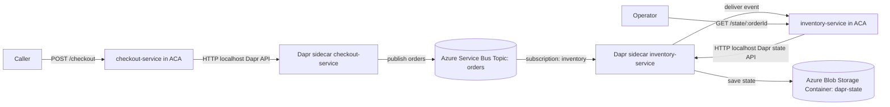

# Enterprise Service Bus Behavior Guide

This document explains how the Azure Service Bus + Dapr architecture in this repository behaves in production.

## Architecture flow

## Event flow

1. Caller invokes `checkout-service` `/checkout`.
2. Service publishes event to Dapr pub/sub component `pubsub`.
3. Dapr sends event to Azure Service Bus topic `orders`.
4. `inventory-service` receives event via Dapr subscription route `/events/orders`.
5. Service writes reservation state through Dapr component `statestore` to Blob Storage.

## Delivery semantics

- Delivery is at least once.
- Consumer duplicates are expected under retry scenarios.
- Consumer logic must be idempotent.
- Message completion is handled by Dapr when the consumer route returns success.

## Storage and retention control

There is no explicit delete call for broker messages in the app code because this is queue semantics, not CRUD semantics.

- Successful processing: message is completed and removed from the active queue by the broker flow.
- Failed processing: message is retried up to `maxDeliveryCount`.
- Expired messages: removed by TTL policy; with `deadLetteringOnMessageExpiration: true` they are moved to DLQ.

This repo enforces control points in infrastructure:

- Service Bus default message TTL via `serviceBusDefaultMessageTimeToLive` (default `P14D`).
- Blob lifecycle retention via `stateBlobRetentionDays` (default `30`).

Operationally, you should also monitor DLQ size and set an alert threshold.

## Failure behavior

- If consumer fails, Dapr signals retry behavior and messages can redeliver.
- If broker or component is unavailable during startup, sidecar/app warm-up can delay readiness.
- During ACA revision replacement, brief transient failures are possible.

## Operational expectations

- Monitor publish errors, subscriber failures, and retry counts.
- Track per-revision error rate during rollout windows.
- Keep min replicas above zero for critical services to reduce cold-start timing races.

## Incident response quick checks

1. Confirm both apps are healthy and on intended active revision.
2. Confirm Dapr components `pubsub` and `statestore` are present in the managed environment.
3. Confirm Service Bus namespace/topic/subscription are healthy.
4. Confirm consumer retries are not causing unbounded duplicate side effects.
5. Confirm state writes are successful and queryable through `inventory-service`.
