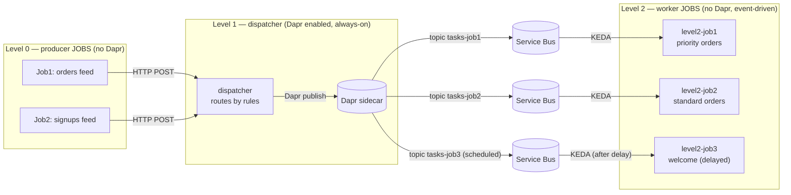

# Guide: A Job → Dispatcher → Job Pipeline with Dapr (No CRON)

This guide is written for people who are **new** to Azure Container Apps, jobs,
Dapr, and message queues. It walks through a small but realistic demo where:

- **two** producer jobs create work,
- a **dispatcher** uses **Dapr** to decide **how** and **when** each piece of
  work runs, and
- **three** worker jobs do the work — each starting **only when there is a
  message for it**, never on a timer (no CRON).

If you have ever ended up with "200 CRON jobs" just to keep work flowing, this
is the pattern that replaces them.

---

## 1. The demo scenario

Imagine a small shop. Two feeds bring in work, and three teams handle it:

**Level 0 — two producer jobs (the feeds):**

| Job | Reads | Emits tasks of kind |
|-----|-------|---------------------|
| **Job1** (`level0-job1`) | `data/orders.txt` | `order` |
| **Job2** (`level0-job2`) | `data/signups.txt` | `signup` |

**Level 1 — the dispatcher (uses Dapr):** looks at each task and decides **how**
(which worker job should handle it) and **when** (run now, or hold it for a
while).

**Level 2 — three worker jobs (the teams):**

| Job | Handles | Triggered when |
|-----|---------|----------------|
| **Job1** (`level2-job1`) | high-value orders (priority fulfillment) | immediately |
| **Job2** (`level2-job2`) | normal orders (standard fulfillment) | immediately |
| **Job3** (`level2-job3`) | signups (welcome email) | after a short delay |

The routing rules (you can change these without touching code):

- `order` with **amount ≥ 100** → **level2-job1** (priority), run now.
- `order` with **amount < 100** → **level2-job2** (standard), run now.
- `signup` → **level2-job3** (welcome), **delayed 30s** so welcome emails are
  batched instead of firing instantly.

---

## 2. The building blocks (quick glossary)

| Term | What it is | Think of it as |
|------|-----------|----------------|
| **Container App** | A long-running container with a web address (always on). | A small website/API that is always awake. |
| **Container App Job** | A container that runs, does a task, then **exits**. | A one-off script that runs and stops. |
| **Dapr** | A helper "sidecar" that gives apps building blocks like pub/sub. | A power adapter that lets your app talk to a queue without SDK code. |
| **Pub/Sub** | "Publish a message" / "subscribe to messages". | A conveyor belt: you drop items on; workers pick them off. |
| **Topic** | A named pub/sub channel. We use **one topic per worker job**. | A separate conveyor belt per team. |
| **Azure Service Bus** | The managed message broker behind the pub/sub. | The conveyor belts' motor and storage. |
| **KEDA** | The autoscaler built into Container Apps. | A manager that hires workers based on how full a belt is. |

> **The one rule that shapes everything:** a **Container App Job cannot run a
> Dapr sidecar**. Dapr (and web ingress) are not supported on jobs. So the part
> that *uses Dapr pub/sub* must live in a normal always-on **Container App** —
> that is our dispatcher (Level 1).

---

## 3. The three tiers



### Level 0 — the producer jobs
- Code: [apps/level0-job/src/index.js](apps/level0-job/src/index.js) (one image,
  run as **two** jobs via env).
- Job1 sets `TASK_KIND=order` and reads
  [apps/level0-job/data/orders.txt](apps/level0-job/data/orders.txt).
- Job2 sets `TASK_KIND=signup` and reads
  [apps/level0-job/data/signups.txt](apps/level0-job/data/signups.txt).
- Each line becomes one structured task that is HTTP `POST`ed to the dispatcher.
- They **cannot** use Dapr (they are jobs), so they just make a web request.

### Level 1 — the dispatcher (the brain)
- Code: [apps/level1-dispatcher/src/index.js](apps/level1-dispatcher/src/index.js)
- `route()` decides **HOW** (which topic = which worker job) and **WHEN**
  (immediate, or a delay).
- It then publishes through **Dapr pub/sub** to the chosen topic:
  `POST http://localhost:3500/v1.0/publish/pubsub/<topic>`.
- For delayed tasks it adds `?metadata.ScheduledEnqueueTimeUtc=...`, which tells
  Service Bus to hold the message until that time. This is the **WHEN**.

### Level 2 — the worker jobs
- Code: [apps/level2-job/src/index.js](apps/level2-job/src/index.js) (one image,
  run as **three** jobs via env).
- Each job has its **own topic + subscription**. **KEDA** watches each
  subscription and starts one execution per pending message. No timers, no CRON.
- The worker reads its message with the Service Bus SDK (jobs can't use Dapr),
  does the work, marks the message complete, and exits.
- A scheduled (delayed) message stays invisible to KEDA until its enqueue time,
  so `level2-job3` only wakes up after the delay.

---

## 4. How "how" and "when" are configured

Everything the dispatcher decides is driven by a small set of values, so you can
change behavior **without editing code**:

| Knob (env on the dispatcher) | Default | Controls |
|------------------------------|---------|----------|
| `HIGH_VALUE_THRESHOLD` | `100` | The order amount that routes to the priority job (**how**). |
| `SIGNUP_DELAY_SECONDS` | `30` | How long signup tasks are held before running (**when**). |
| `TOPIC_JOB1/2/3` | `tasks-job1/2/3` | Which topic (and therefore which worker job) each rule targets. |

These are set in [infra/main.bicep](infra/main.bicep) (`highValueThreshold`,
`signupDelaySeconds`, and the topic params) and passed to the dispatcher as
environment variables.

---

## 5. Why this kills the "200 CRONs" problem

| Old way (CRON) | New way (this pattern) |
|----------------|------------------------|
| One scheduled job per work item. | A handful of job **definitions**, reused for all items. |
| Wakes on a timer even when idle. | Starts **only** when a message exists. |
| Adding work = adding/maintaining CRONs. | Adding work = publishing one more message. |
| Routing/priority logic scattered everywhere. | One place (`route()`) decides how + when. |

The number of CRON expressions goes from *N* to **zero**.

---

## 6. What lives where in this repo

| Piece | Path |
|-------|------|
| Level 0 producer image (Job1 + Job2) | [apps/level0-job/](apps/level0-job/) |
| Level 1 dispatcher (Dapr publisher / router) | [apps/level1-dispatcher/](apps/level1-dispatcher/) |
| Level 2 worker image (Job1 + Job2 + Job3) | [apps/level2-job/](apps/level2-job/) |
| Infrastructure (apps, jobs, topics, KEDA rules) | [infra/main.bicep](infra/main.bicep) |
| Parameters (image names, etc.) | [infra/main.parameters.json](infra/main.parameters.json) |
| Build + deploy script | [scripts/deploy-azure.sh](scripts/deploy-azure.sh) |

Key infrastructure details:
- **Three** topics (`tasks-job1/2/3`), each with a `workers` subscription.
- The dispatcher is the only app in the Dapr `pubsub` component `scopes`.
- Each Level 2 job uses `triggerType: 'Event'` with an `azure-servicebus` KEDA
  scale rule (`messageCount: '1'` = one execution per message) bound to its own
  topic.

---

## 7. How to deploy and run it

> **Prerequisites:** Azure CLI (`az`) logged in, Docker installed, and an
> existing Azure Container Registry (ACR).

1. **Set your names** in [infra/main.parameters.json](infra/main.parameters.json):
   `acrName` and `serviceBusNamespaceName` must be valid/unique.

2. **Deploy everything** (builds images, pushes them, deploys infra):
   ```bash
   ./scripts/deploy-azure.sh -g rg-aca-dapr -l westeurope
   ```

3. **Run the pipeline** by starting the two Level 0 producer jobs:
   ```bash
   az containerapp job start -g rg-aca-dapr -n level0-job1   # orders
   az containerapp job start -g rg-aca-dapr -n level0-job2   # signups
   ```

4. **Watch it route.** With the sample data:
   - orders 999.00, 149.99, 120.50 → **level2-job1** (priority), run now.
   - orders 45.00, 30.00 → **level2-job2** (standard), run now.
   - all 3 signups → **level2-job3** (welcome), run ~30s later.

5. **See the executions per worker:**
   ```bash
   az containerapp job execution list -g rg-aca-dapr -n level2-job1 -o table
   az containerapp job execution list -g rg-aca-dapr -n level2-job2 -o table
   az containerapp job execution list -g rg-aca-dapr -n level2-job3 -o table
   ```
   Notice `level2-job3` stays idle for the delay window, then runs — that is the
   "when" in action.

---

## 8. Make it your own

- **Add a routing rule:** edit `route()` in
  [apps/level1-dispatcher/src/index.js](apps/level1-dispatcher/src/index.js) to
  send a new task kind to a topic.
- **Add a worker:** add a topic to `taskTopics` and an entry to `level2Jobs` in
  [infra/main.bicep](infra/main.bicep) — the loops create the topic,
  subscription, job, and role assignment for you.
- **Change priority/delay:** tweak `highValueThreshold` and `signupDelaySeconds`
  in [infra/main.bicep](infra/main.bicep).
- **Do real work:** replace the body of `processTask()` in
  [apps/level2-job/src/index.js](apps/level2-job/src/index.js).
- **Throttle a fragile downstream system:** lower `level2MaxExecutions` so you
  never hammer it, no matter how many messages arrive.

---

## 9. Common questions

**Q: Why can't the Level 0 jobs publish to Dapr directly?**
Because Container App Jobs don't get a Dapr sidecar. Only the always-on
dispatcher does. So Level 0 talks to the dispatcher over plain HTTP, and the
dispatcher does the Dapr publish.

**Q: How does the dispatcher "trigger" a specific job?**
It publishes to that job's **topic**. Each Level 2 job is KEDA-scaled on its own
topic/subscription, so publishing to `tasks-job1` effectively starts
`level2-job1`.

**Q: How does the "delay" (when) actually work?**
The dispatcher adds `metadata.ScheduledEnqueueTimeUtc` to the Dapr publish.
Service Bus holds the message until that time; KEDA only counts it once it
becomes active, so the worker starts then — not before.

**Q: Why do Level 2 jobs use the Service Bus SDK instead of Dapr?**
Same reason — they're jobs, so no Dapr sidecar. KEDA triggers them from the
queue, and they read/acknowledge their message with the SDK.

**Q: What if a worker crashes mid-task?**
The message is *abandoned* (not completed), so Service Bus redelivers it later.
Make `processTask()` **idempotent** (safe to run twice).

**Q: Do I ever need a CRON again?**
Only if you want to *start* the Level 0 feeds on a schedule. Even then it's one
CRON per feed — not one per item.
